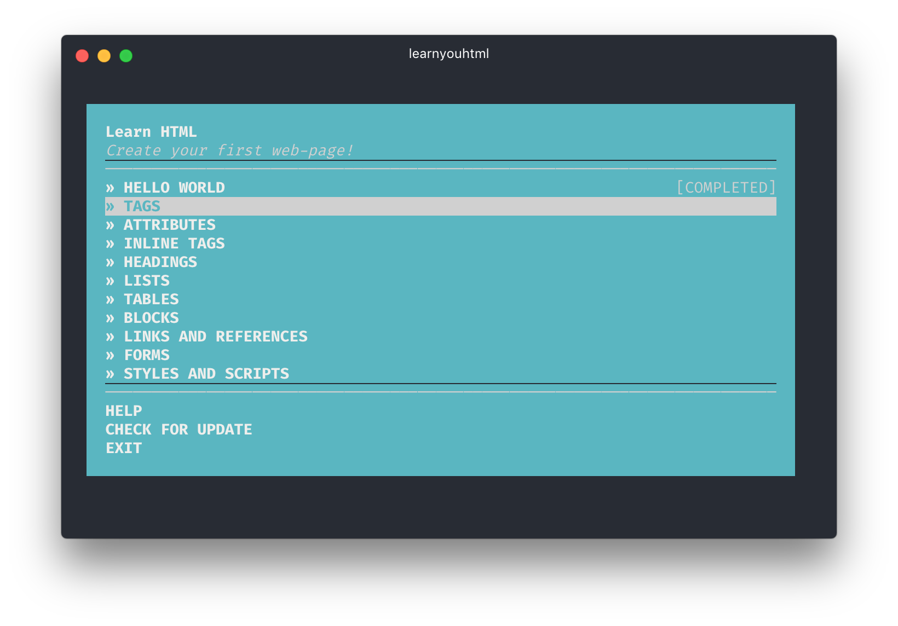

# learnyouhtml

> Learn you how to create your first web-page.

**Hypertext Markup Language (HTML)** is the standard markup language for creating web pages and web applications. With Cascading Style Sheets (CSS) and JavaScript, it forms a triad of cornerstone technologies for the World Wide Web.[1] Web browsers receive HTML documents from a web server or from local storage and render them into multimedia web pages. HTML describes the structure of a web page semantically and originally included cues for the appearance of the document.

## Exercises

* **HELLO WORLD** — introduction to HTML. [**[SOLUTION](./projecs/00-hello-world/)**]
* **TAGS** — understanding tags. [**[SOLUTION](./projecs/01-tags/)**]
* **ATTRIBUTES** — what is tag's attributes. [**[SOLUTION](./projecs/02-attributes/)**]
* **INLINE TAGS** — tags for styling text. [**[SOLUTION](./projecs/03-inline-tags/)**]
* **HEADINGS** — tags for headings. [**[SOLUTION](./projecs/04-headings/)**]
* **LISTS** — how to create a list with HTML tags. [**[SOLUTION](./projecs/05-lists/)**]
* **TABLES** — how to compose data in table. [**[SOLUTION](./projecs/06-tables/)**]
* **BLOCKS** — block tags and semantic. [**[SOLUTION](./projecs/07-blocks/)**]
* **LINKS AND REFERENCES** — how to leave a references to another page. [**[SOLUTION](./projecs/08-links-and-references/)**]
* **FORMS** — creating of forms with control elements. [**[SOLUTION](./projecs/09-forms/)**]
* **STYLES AND SCRIPTS** — injecting styles and scripts on a page. [**[SOLUTION](./projecs/10-styles-and-scripts/)**]

## Original Author Repository

[learnyouhtml](https://github.com/denysdovhan/learnyouhtml) by [Denys Dovhan](http://denysdovhan.com)

## License

MIT © [Denys Dovhan](http://denysdovhan.com)
